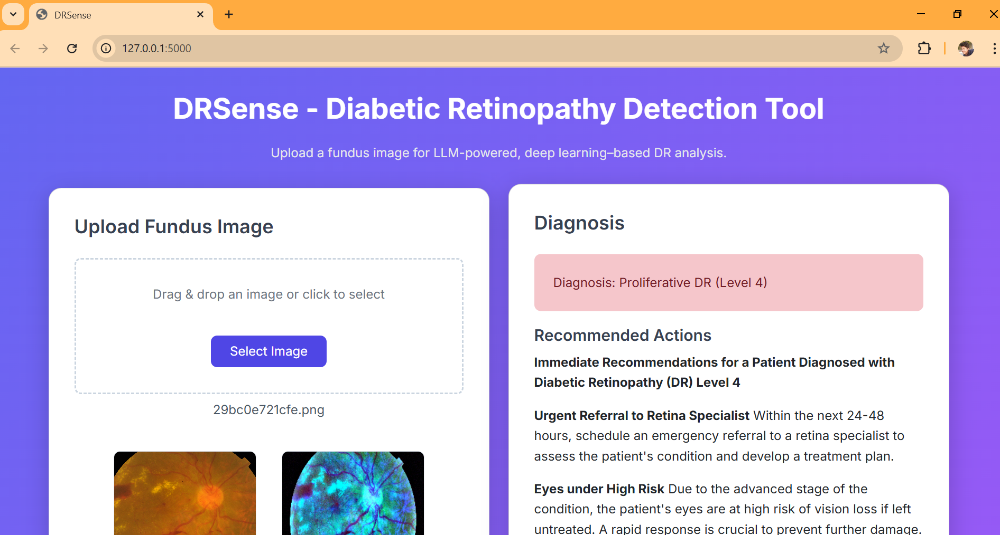
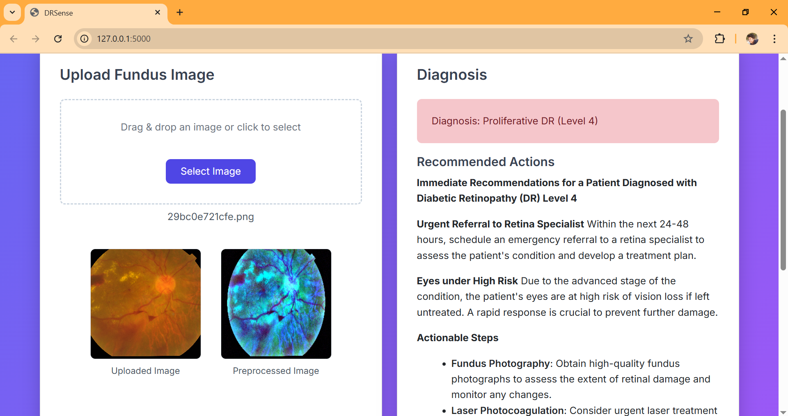
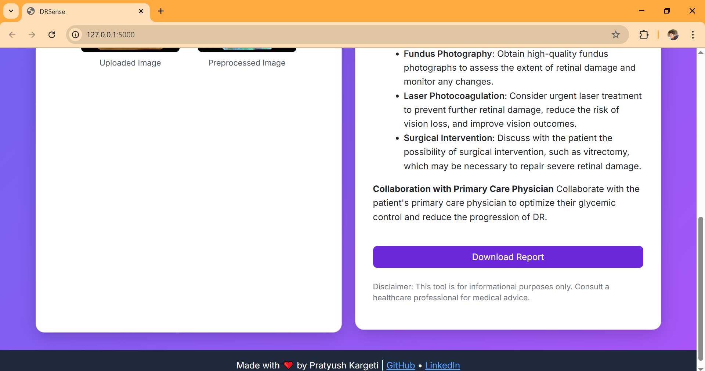

# DRSense - Diabetic Retinopathy Detection Tool

**DRSense** is a web-based tool for detecting diabetic retinopathy (DR) from fundus images using deep learning and large language model (LLM)-powered recommendations. Built with Flask, TensorFlow, and Groq, it leverages applied machine learning, deep learning, and transfer learning to provide healthcare professionals with immediate, actionable insights for DR diagnosis and management.

- **Frontend**: Static `index.html` hosted on Netlify.
- **Backend**: Flask API with TensorFlow model hosted on Render.
- **Model**: DenseNet121-based classifier (`densenet_fundus_clahe_final.h5`) for DR severity classification.
- **LLM**: Llama3 for generating hospital-grade recommendations, trained on 8 billion parameters.

---

## Deployment

- **Frontend**: Hosted on Netlify ([Live Demo](https://drsense-pratyush-kargeti.netlify.app/)).
- **Backend**: Hosted on ([Render](https://drsense-diabetic-retinopathy-detection.onrender.com/)).

---

## Testing the Model

To test the DRSense tool, you can use sample fundus images provided in the GitHub repository.

> **Note**: Ensure the input images are high-resolution fundus photographs for accurate results. The sample images are representative of the APTOS 2019 dataset used for training.

---

## Features
- **Image Upload**: Drag-and-drop or select fundus images for analysis.
- **Preprocessing**: Applies CLAHE and brightness/contrast adjustments to enhance image quality.
- **Prediction**: Classifies DR into 5 levels (No DR, Mild, Moderate, Severe, Proliferative).
- **Recommendations**: Provides concise, Markdown-formatted advice for healthcare professionals.
- **Report Generation**: Downloads a PDF report with original/preprocessed images, diagnosis, and recommendations.
- **Responsive UI**: Built with Tailwind CSS and Bootstrap for a modern, mobile-friendly interface.

---

## Screenshots

Below are sample screenshots of the tool in action:

   
  <!-- <em>Image upload and preview interface</em> -->

   
  <!-- <em>DR prediction result and classification</em> -->

   
  <!-- <em>LLM-powered recommendations and downloadable PDF report</em> -->

---

## Tech Stack
- **Frontend**: HTML, CSS, JavaScript, Tailwind CSS, Bootstrap
- **Backend**: Flask, TensorFlow, OpenCV, Groq API
- **Deployment**: Netlify (frontend), Render (backend)
- **Dependencies**: See `backend-requirements.txt` for Python packages
- **Model**: DenseNet121 (`densenet_fundus_clahe_final.h5`, 86.1 MB)

---

## Dataset Details
- **Source**: [APTOS 2019 Blindness Detection Dataset](https://www.kaggle.com/c/aptos2019-blindness-detection)
- **Size**: 3,662 high-resolution eye fundus images
- **Purpose**: Used to train and evaluate the deep learning model for diabetic retinopathy severity classification

---

## Model and Performance
- **Architecture**: CNN based on DenseNet121, pre-trained on ImageNet and fine-tuned for DR classification
- **Task**: 5-class severity classification (No DR, Mild, Moderate, Severe, Proliferative)
- **Performance**: 
  - **Training Accuracy**: 98% on 3,295 images  
  - **Validation Accuracy**: 83% on 367 images

---

## Image Preprocessing
- **Method**: Contrast Limited Adaptive Histogram Equalization (CLAHE)
- **Process**:
  - Enhances local contrast in fundus images
  - Improves visibility of blood vessels and lesions
- **Benefits**:
  - Prepares images for more accurate analysis
  - Enhances model performance

---

## Prerequisites
- Python 3.8+
- Git
- Groq API key
- Accounts for [Netlify](https://netlify.com) and [Render](https://render.com)

---
